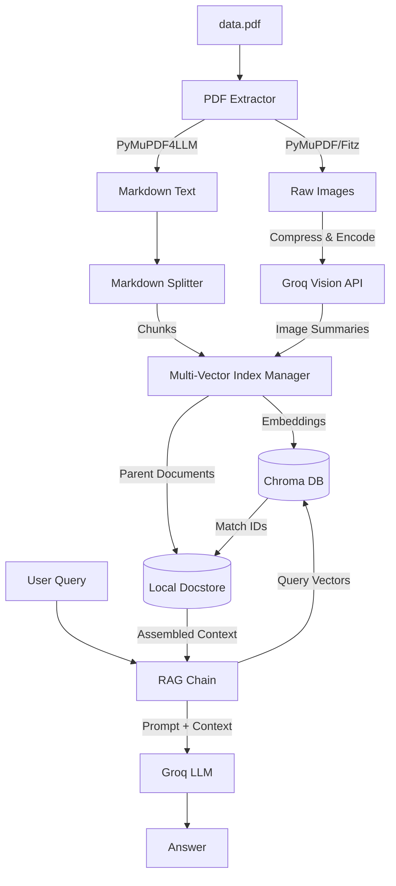

# DocuLens: Multi-Modal PDF RAG

DocuLens is a high-performance **Multi-Modal Retrieval-Augmented Generation (RAG)** pipeline designed to extract, index, and query both text and image content (such as architectures, diagrams, and tables) from complex PDF documents.

By leveraging a **Multi-Vector Retrieval** strategy, DocuLens processes standard text alongside detailed vision-based summaries of embedded images, mapping them back to their original parent contexts.

---

## 🏗️ Architecture Workflow

The system parses raw documents into structured Markdown, extracts and compresses images, generates vision-based summaries, and builds a dual-store index (vector database + key-value docstore) for precise context retrieval.



---

## ✨ Features

* **Structural Text Extraction**: Transforms raw PDF text and tables into clean Markdown formats using `pymupdf4llm`.
* **Smart Image Extraction**: Filters out tiny icons and lines, extracting only high-value diagrams, charts, and figures.
* **Auto-Compression**: Scales down images to 512x512 JPEG format before processing to reduce latency and API token consumption.
* **Multi-Vector Indexing**: Employs a dual-store setup utilizing **Chroma** (for fast vector searches of summaries) and a **Local File Store** (for retrieving full-context document chunks).
* **Conversational Interface**: Interactive CLI to ask questions about the indexed documents.

---

## 📁 Project Structure

```text
├── data/                  # Store your PDFs and generated database indices (Git ignored)
│   ├── chroma/            # Vector database directories
│   ├── docstore/          # Document key-value store files
│   └── data.pdf           # The target document to query
├── src/
│   ├── extraction.py      # Extract text to Markdown and pull images from PDF
│   ├── image_summarizer.py# Preprocess and summarize diagrams using a Vision model
│   ├── index_manager.py   # Manage indexing inside Chroma and Docstore
│   ├── rag_chain.py       # Core prompt assembly and final LLM invocation
│   ├── splitter.py        # Parse Markdown chunks based on header hierarchy
│   └── test_extractor.py  # Command-line entry point
├── .env                   # Configuration file (Git ignored)
├── .gitignore             # Files to exclude from version control
└── requirements.txt       # Python dependencies
```

---

## 🚀 Setup & Installation

### 1. Prerequisites
* Python 3.10 or higher installed.
* A **Groq API Key** (Get one at [console.groq.com](https://console.groq.com/)).

### 2. Install Dependencies
Clone the repository and install the required libraries:
```bash
pip install -r requirements.txt
```

### 3. Environment Configuration
Create a `.env` file in the root directory and add your API keys:
```env
GROQ_API_KEY=gsk_your_actual_groq_api_key_here
```

### 4. Feed Your Data
Create a folder named `data/` in the root of the project and place your target PDF named `data.pdf` inside it:
```text
data/data.pdf
```

---

## 💻 Running the System

Start the indexer and start chatting with your PDF by running the test script:
```bash
python src/test_extractor.py
```

* **First Run**: The system will parse the PDF, run image summarization, and build the local indexes.
* **Subsequent Runs**: It will detect the existing indexes and ask if you want to load them directly, saving time and API tokens.
